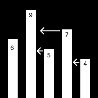

# [2493](https://www.acmicpc.net/problem/2493)
solved on: 2024-04-14

## Solutions


- 풀었었는데 풀이가 생각이 안나는 거 보니 답을 보고 풀었던 것 같다. 이번에는 혼자 힘으로 풀어보자.

## Troubleshooting

### vector<int>::iterator = rbegin()
```c++
for (vector<int>::iterator it = ans.rbegin(); it != ans.rend(); ++it)
{
	cout << *it << ' ';
}
```
vector<int>::iterator에 rbegin()이 안담기는 문제가 있었다.
rbegin()은 reverse_iterator를 반환하는데, iterator와 reverse_iterator는 다른 타입이라 그랬다.

### Timeout

```c++
#include <iostream>
#include <algorithm>
#include <stack>
using namespace std;

#define ll long long
#define f(i, n) for (int i = 0; i < n; i++)

int find_tower(stack<int> st)
{
	int seeker = st.top();
	
	while (!st.empty())
	{
		if (seeker < st.top())
		{
			return st.size();
		}
		st.pop();
	}
	return 0;
}

int	main(void)
{
	ios::sync_with_stdio(false), cin.tie(nullptr);

	int n; cin >> n;
	stack<int> st;
	vector<int> ans;

	f(i, n)
	{
		int height; cin >> height;
		st.push(height);
	}

	while (!st.empty())
	{
		ans.push_back(find_tower(st));
		st.pop();
	}
	
	for (vector<int>::reverse_iterator rit = ans.rbegin(); rit != ans.rend(); ++rit)
	{
		cout << *rit << ' ';
	}
	cout << endl;
	return 0;
}
```
너무 날로먹는 코드를 짜서 시간초과가 났다. O(n^2)의 시간복잡도를 가지고 있었기 때문이다. 이를 O(n)으로 ~~줄여보자.~~ 줄여서 통과했다!

## References
- [c++ rbegin](https://cplusplus.com/reference/vector/vector/rbegin/)
