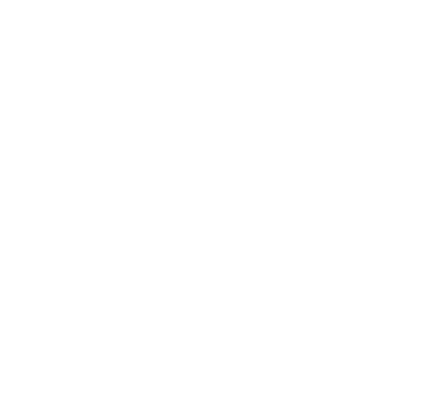

# [1021](https://www.acmicpc.net/problem/1021)
solved on: 2024-04-30

## Solutions

- 큐를 1차원적으로 좌, 우로 이동시킨다고 생각했을 때 어려웠는데, 2차원적으로 원형 큐가 있고 커서가 이동하는 것으로 생각하니 쉬워졌다.
- 과거에 풀었던 코드를 보니 비슷하게 풀었는데 지금의 코드가 더 깔끔하다 !

## References
