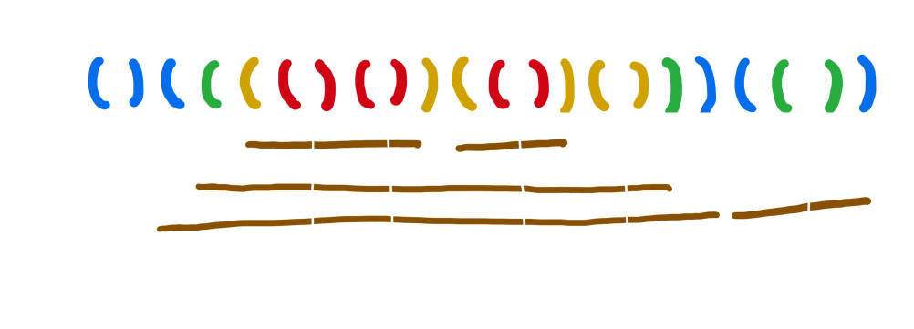

# [10799](https://www.acmicpc.net/problem/10799)
solved on: 2024-05-01

## Solutions

- 막대와 레이저를 vector에 저장하고, 레이저를 찾아서 막대를 자르는 방식으로 풀었다.
- 다 풀고 나서 [바킹독 풀이](https://github.com/encrypted-def/basic-algo-lecture/blob/master/0x08/solutions/10799.cpp)를 보았는데 이 방법이 더 효율적이다.
- 마지막에 잘린 막대기의 개수를 구할 때 $O(n^2)$으로 풀었다고 생각하여 시간초과가 날 것이라고 생각했는데, 시간초과가 나지 않았다.
- 좀 더 효율적인 풀이를 고민해보자.

## References
